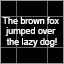
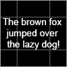
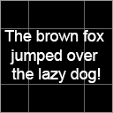
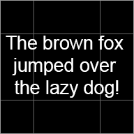
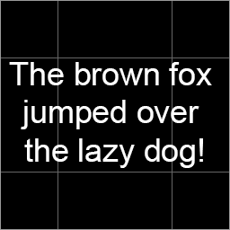

# Scaling/Text

**All image files in this directory is licensed under CC0 1.0.**

Contains images that are intended to make it easy to detect scaling errors when trying to render pixel perfect graphics.

Image                            | px        | dp        | Scale | Comment
---------------------------------|-----------|-----------|-------|-------------------------------------------------------------
Test64x64_160dpi                 |  64 x  64 |  64 x  64 |   1.0 | Simple image created for all dp's following standard scaling rules.
Test64x64_240dpi                 |  96 x  96 |  64 x  64 |   1.5 |
Test64x64_320dpi                 | 128 x 128 |  64 x  64 |   2.0 |
Test64x64_480dpi                 | 192 x 192 |  64 x  64 |   3.0 |
Test64x64_640dpi                 | 256 x 256 |  64 x  64 |   4.0 |

